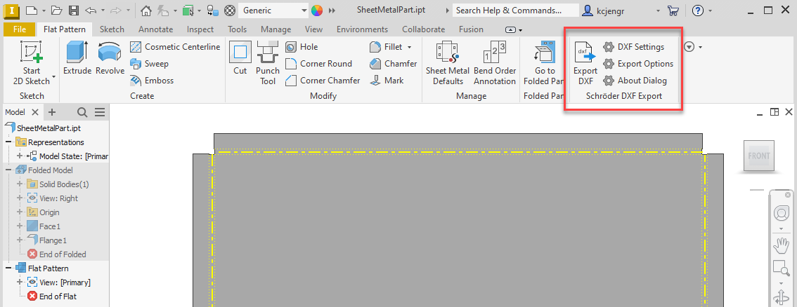
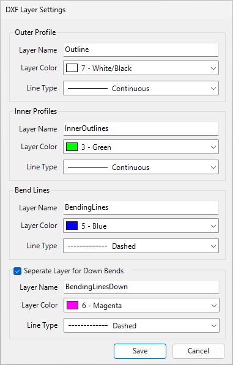
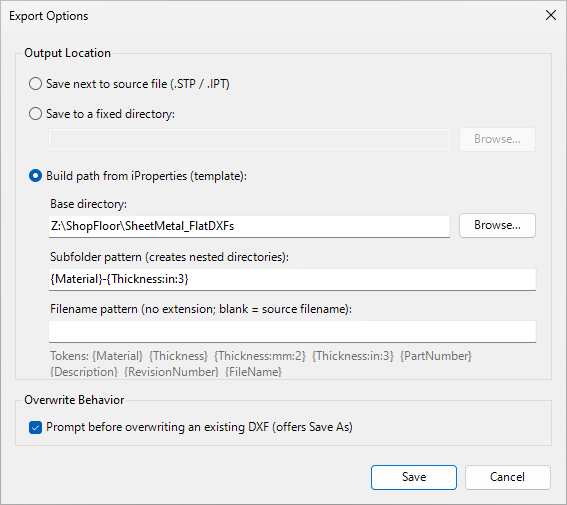

# Overview

The Inventor DXF Export AddIn automates the export of flat-pattern DXF files from
Autodesk Inventor sheet-metal parts, and is specifically designed to produce DXFs for
use with **Schröder's POS3000** control system.

Key capabilities:

- Embeds xData with all model geometry into DXF for Schröder POS3000 to import,
  eliminating the need for manual data entry.
- One-click flat-pattern DXF export from the Flat Pattern ribbon tab.
- Configurable layer names, colors, and line types for outer profiles, interior
  profiles, and bend lines (up and down separately).
- Three output location modes: next to source file, fixed directory, or a template
  path built from iProperties.
- Overwrite protection with optional *Save As* fallback.
- Structured log files for troubleshooting.

---

# Installation

## Requirements

- Autodesk Inventor 2020 or later (tested on 2022, 2024, 2026).
- Windows 10 or 11, 64-bit.
- .NET Framework 4.8 (included with Windows 10 v1903+).

## MSI Installer

1. Run `InventorDxfExportAddin-x.x.x.msi`.
2. Accept the license and follow the installer prompts.
3. The AddIn is installed to:
   ```
   %APPDATA%\Autodesk\ApplicationPlugins\InventorDxfExport\
   ```
4. Start Inventor. The **Schröder DXF Export** panel appears on the *Flat Pattern*
   tab of the Part ribbon.

Reinstalling the same or a newer version automatically replaces the previous installation —
no manual uninstall step is required.

## Uninstall

Use *Settings → Apps* (Windows 11) or *Control Panel → Programs* to remove
**Schröder DXF Export AddIn**.

---

# Ribbon Buttons

All buttons appear in the **Schröder DXF Export** panel on the *Flat Pattern* tab.
The tab is only visible when a Part document with a flat pattern is active.



| Button         | Description |
|----------------|-------------|
| Export DXF     | Exports the active part's flat pattern to a DXF file using the current settings. |
| DXF Settings   | Opens the layer and line-type configuration dialog. |
| Export Options | Opens the output location and overwrite-behaviour dialog. |
| About          | Shows the AddIn version, installation path, and log file location. |

---

# Exporting a DXF

1. Open a sheet-metal part and switch to the *Flat Pattern* view.
2. Click **Export DXF**.
3. If the part has not been saved, you will be prompted to choose an output location.
4. If a DXF already exists at the target path and *Prompt before overwriting* is
   enabled, a dialog asks whether to overwrite, save to an alternate path, or cancel.
5. A confirmation message shows the full output path on success.

The AddIn automatically unfolds the flat pattern if one does not already exist.

---

# DXF Settings

The DXF Settings dialog configures how geometry is written to DXF layers. Settings
are persisted per user. When an organization-wide configuration is active (see
[Organization Settings](#organization-settings)), a **↺** button appears next to
any value that differs from the shared baseline, and clicking it restores that
setting to the org default.



## Outer Profile

| Setting      | Description |
|--------------|-------------|
| Layer name   | Name of the DXF layer (default: `Outline`). |
| Layer color  | RGB color assigned to the layer. |
| Line type    | Line type applied to outer profile entities. |

## Interior Profiles

| Setting      | Description |
|--------------|-------------|
| Layer name   | Default: `InnerOutlines`. |
| Layer color  | RGB color for the layer. |
| Line type    | Line type for interior profile entities. |

## Bend Lines

Bend line geometry can be separated by direction for downstream CAM compatibility.

| Setting                              | Description |
|--------------------------------------|-------------|
| Bend Up layer / color / line type   | Layer for upward bends. Default layer: `BendingLines`, color: blue. |
| Bend Down layer / color / line type | Layer for downward bends. Default layer: `BendingLines`, color: magenta. |
| Enable bend-down layer               | When unchecked, down-bend lines are written to the bend-up layer. |

---

# Export Options



## Output Location Modes

### Save next to source file *(default)*

The DXF is placed in the same directory as the open `.ipt` file, or next to the
source `.stp` / `.step` file if the part was derived from a STEP import. If the
part has never been saved, a Save dialog is shown.

### Save to a fixed directory

All DXF files are written to a single user-specified folder regardless of where
the source parts live. Click **Browse…** to choose the folder.

### Build path from iProperties (template)

The output directory and filename are built at export time by expanding tokens that
reference the part's iProperties and sheet-metal data. Useful for organizing
outputs into nested folders by material, thickness, and so on.

| Field             | Description |
|-------------------|-------------|
| Base directory    | Root folder under which the template path is built. |
| Subfolder pattern | Template that creates nested subdirectories. Example: `{Material}\{Thickness:mm:2}` |
| Filename pattern  | Template for the output filename (no extension). Leave blank to use the Inventor document filename. |

## Token Reference

Tokens are written as `{TokenName}` in either template field and expanded at
export time. Values are sanitized — characters illegal in Windows file names are
replaced with underscores.

| Token             | Source |
|-------------------|--------|
| `{Material}`       | *Material* iProperty. |
| `{PartNumber}`     | *Part Number* iProperty. |
| `{Description}`    | *Description* iProperty. |
| `{RevisionNumber}` | *Revision Number* iProperty. |
| `{FileName}`       | Inventor document filename, without extension. |
| `{Thickness}`      | Sheet-metal thickness in the document's display unit, trailing zeros removed (e.g. `3mm`, `0.125in`). |

### Thickness token options

`{Thickness}` accepts optional unit and precision arguments separated by colons.
All parts are optional.

```
{Thickness}        document units, auto precision
{Thickness:mm}     millimetres, auto precision
{Thickness:in}     inches, auto precision
{Thickness:mm:2}   millimetres, 2 decimal places  ->  3.00mm
{Thickness:in:3}   inches, 3 decimal places       ->  0.125in
{Thickness::2}     document units, 2 decimal places
```

Supported units: `mm`, `cm`, `m`, `in`, `ft`.

**Example** — with base directory `C:\DXF Output` and subfolder template
`{Material}\{Thickness:mm:2}`, exporting a part made from *Aluminum 5052* at
3 mm thickness produces:

```
C:\DXF Output\Aluminium 5052\3.00mm\PartName.dxf
```

If a token's iProperty is empty, the token expands to an empty string and any
resulting doubled path separators are cleaned up automatically.

## Reset to Org Defaults

When an organization-wide configuration is active, a **↺ Reset to org defaults**
button appears at the bottom left of the Export Options dialog. Clicking it
restores all export fields to the values from the shared configuration. The
change is not saved until you click **Save**.

## Overwrite Behavior

When **Prompt before overwriting** is enabled (the default) and a DXF already
exists at the target path, a dialog asks:

- **Yes** — overwrite the existing file.
- **No** — open a *Save As* dialog to choose an alternate path.
- **Cancel** — abort the export; nothing is written.

Disabling the option causes existing files to be overwritten silently.

---

# Organization Settings

Administrators can deploy a shared baseline configuration that all installations
load at startup. Users can override any setting locally; the UI indicates which
settings differ from the org baseline and offers a one-click reset.

## Deploying the Global Config

1. Copy `global_settings.jsonc` (included in the AddIn installation directory
   under `docs\`) to a network share that all users can read, for example:
   ```
   \\server\dxf-config\global_settings.jsonc
   ```

2. On each workstation — or via Group Policy / MDM — create the following
   registry value:
   ```
   HKEY_LOCAL_MACHINE\SOFTWARE\InventorDxfExport
     GlobalConfigPath  REG_SZ  \\server\dxf-config\global_settings.jsonc
   ```

   PowerShell (run as Administrator):
   ```powershell
   New-Item -Path "HKLM:\SOFTWARE\InventorDxfExport" -Force | Out-Null
   Set-ItemProperty -Path "HKLM:\SOFTWARE\InventorDxfExport" `
       -Name GlobalConfigPath `
       -Value "\\server\dxf-config\global_settings.jsonc"
   ```

3. Restart Inventor. The shared config is loaded at addin startup; no further
   action is required.

If the registry key is absent, or the file cannot be read, the feature is
completely inactive and the addin behaves as if it were not configured.

## Editing the Global Config

`global_settings.jsonc` is a JSON file that supports `//` and `/* */` comments.
Every key is optional — omit a key to let the addin use its built-in default.

Layer colors may be specified as an ACI color name or as an `"R, G, B"` triple:

| Name        | RGB            | DXF ACI index |
|-------------|----------------|---------------|
| `Red`       | `255, 0, 0`    | 1 |
| `Yellow`    | `255, 255, 0`  | 2 |
| `Green`     | `0, 255, 0`    | 3 |
| `Cyan`      | `0, 255, 255`  | 4 |
| `Blue`      | `0, 0, 255`    | 5 |
| `Magenta`   | `255, 0, 255`  | 6 |
| `White`     | `255, 255, 255`| 7 |
| `DarkGray`  | `128, 128, 128`| 8 |
| `LightGray` | `192, 192, 192`| 9 |

Custom colors outside this palette (e.g. `"192, 0, 0"`) are supported and will
appear as *Custom* entries in the color picker.

Line types accepted in the config:

```
kContinuousLineType   kDashedLineType   kDottedLineType
kDashDotLineType      kDefaultLineType
```

## Per-User Overrides

Each user's deviations from the global config are stored privately in:

```
%APPDATA%\InventorDxfExport\user_settings.json
```

Only keys that differ from the global config are written to this file.
Resetting a setting via the **↺** button removes its entry, so the file stays
minimal. Deleting `user_settings.json` fully restores the org defaults.

---

# POS3000 Integration

The AddIn writes DXF extended data (xData) directly into every exported file so
that Schröder POS3000 control software can import the part and reconstruct a fully
defined 3D model without any manual data entry.

Two application IDs are registered in each DXF:

| Application ID        | Attached to     | Purpose |
|-----------------------|-----------------|---------|
| `POS3000_V3_PRODUCT`  | Outline layer   | Material and thickness for part. |
| `POS3000_V3_BENDINGLINE` | Each bend line entity | Per-bend geometry. |

## Product xData

Written once to the outer-profile layer (default: `Outline`).

| Field        | Format              | Source |
|--------------|---------------------|--------|
| `Thickness`  | `Thickness=N.NNNN`  | Sheet-metal thickness in display units. |
| `MaterialId` | `MaterialId=(name)` | Inventor material name from part. |

## Bend Line xData

Written to each bend line entity on the bend-up or bend-down layer.

| Field          | Format                | Source |
|----------------|-----------------------|--------|
| `BendAngleDeg` | `BendAngleDeg=N.NNN`  | Bend angle. Up positive; down negative. |
| `InnerRadius`  | `InnerRadius=N.NNNN`  | Inner bend radius in display unit. |
| `K_Factor`     | `K_Factor=N.NNN`      | K-factor from Inventor sheet-metal rule for bend. |

Bend lines are shortened by 0.1 units at each end so they do not touch the part
outline — this matches POS3000's expected geometry convention.

---

# About Dialog

The **About** dialog displays:

- Inventor version currently running.
- AddIn version.
- AddIn installation directory (selectable and copyable).
- Log file directory (selectable and copyable).

The **Open Error Log** button opens the current day's log file in the system
default text editor.

---

# Log Files

The AddIn writes a rolling daily log to:

```
%APPDATA%\Autodesk\ApplicationPlugins\InventorDxfExport\logs\event_log_YYYYMMDD.txt
```

A separate `startup_error.txt` in the same folder captures fatal errors that occur
before the main logger is initialized (e.g. a missing DLL or COM registration
failure).

---

# Troubleshooting

| Symptom | Remedy |
|---------|--------|
| Ribbon panel does not appear | Confirm the part is a sheet-metal part and the Flat Pattern tab is active. Check `startup_error.txt` for load failures. |
| *Not a valid Sheetmetal component* | Only `.ipt` files created with the Sheet Metal template are supported. |
| *Unfold error* | Inventor could not generate a flat pattern. Resolve the fold geometry issue in the model and retry. |
| Empty or missing tokens | Populate the corresponding iProperty on the part, or adjust the template. |
| Export lands in the wrong folder | In Export Options, verify the base directory and template strings. |

---

# Version History

| Version | Changes |
|---------|---------|
| 0.1.5 | Organization-wide settings sync via a shared JSONC file on a network share. Per-setting ↺ reset buttons in DXF Settings; single reset button in Export Options. iProperty token picker (… buttons) with live current-value preview. Live output-path preview in Export Options. Base directory now optional (falls back to source-file directory). |
| 0.1.3 | Export Options dialog: fixed directory, iProperty template with unit/precision control, overwrite prompt with Save As fallback. About dialog: copyable path and version fields. Dialogs centered on the Inventor window. MSI same-version reinstall support. |
| 0.1.2 | DXF Settings dialog: configurable layers, colors, and line types for outer profile, interior profiles, and bend lines (up/down independently). |
| 0.1.1 | Initial release. One-click flat-pattern DXF export. |
